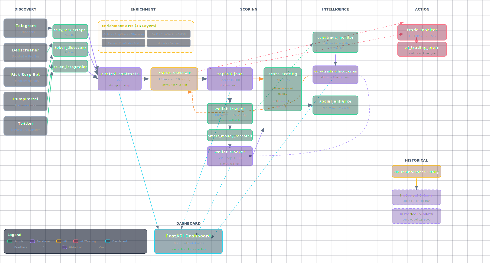

# Hermes Token Screener

Autonomous smart-money tracking system that discovers, enriches, and ranks tokens and wallets across Telegram call channels and DEX platforms.

## Architecture



## Scripts

| Script | Purpose | Cron | Runtime |
|--------|---------|------|---------|
| `telegram_scraper.py` | Harvest contract addresses from 62 Telegram chats | `*/10 * * * *` | ~30s |
| `token_discovery.py` | Pull Dexscreener boosted + new profiles | `*/30 * * * *` | ~2s |
| `token_enricher.py` | 12-layer enrichment + scoring | `10 * * * *` | ~8 min |
| `wallet_tracker.py` | Discover + score wallets from top tokens | `15 * * * *` | ~15s |
| `smart_money_research.py` | Pattern learning + leaderboard | on-demand | ~5s |
| `db_maintenance.py` | Prune to top 1000 tokens + wallets | `0 0 * * *` | ~1s |

## Token Enrichment (12 Layers)

| Layer | Source | Data | Required |
|-------|--------|------|----------|
| 0 | Dexscreener | Volume, txns, FDV, liquidity, price | Yes |
| 1 | Surf | Social sentiment, mindshare, trending | No |
| 2 | GoPlus v2 | EVM security (honeypot, tax, mint) | No |
| 3 | RugCheck | Solana security (rug score, insiders) | No |
| 4 | Etherscan | Contract verification | No |
| 5 | De.Fi | Security analysis, holder concentration | No |
| 6 | Derived | Computed signals from Dexscreener data | No |
| 7 | CoinGecko | Market data, exchange listings | No |
| 8 | GMGN | Dev conviction, smart money, bot detection | No |
| 9 | Social | Telegram DB + composite social score | No |
| 10 | Zerion | Price, market cap, FDV, supply, verified | No |

Each enricher is wrapped in try/except. If it fails, its fields are skipped but the pipeline continues. Only Layer 0 (Dexscreener) is required.

## Token Scoring (0-100)

Base score from 6 factors:

| Factor | Points | Description |
|--------|--------|-------------|
| Social momentum | 0-35 | Cross-channel calls + Telegram velocity |
| Freshness | 0-15 | Newer tokens score higher |
| Low FDV | 0-15 | Lower market cap = more upside |
| Volume | 0-24 | Absolute + accelerating volume |
| Transactions | 0-15 | Txn count + buy-heavy ratio |
| Price momentum | 0-10 | h1/h6/h24 price direction |

Multipliers: verified contract (+20%), dev holding (+25%), LP burned (+15%), smart wallets >20 (+15%), BINANCE listed (+10%), CoinGecko low risk (+5%)

**Steep decline penalties** (price collapse = unlikely to recover):

| Condition | Penalty |
|-----------|---------|
| h1 < -60% | score × 0.1 (rug in progress) |
| h1 < -40% | score × 0.2 |
| h1 < -25% | score × 0.5 |
| h6 < -70% | score × 0.1 (dead) |
| h6 < -50% | score × 0.2 (crashed) |
| h6 < -30% | score × 0.5 (declining) |
| Death spiral (vol dying + declining) | score × 0.3 |

## Wallet Scoring (0-100)

| Factor | Points | Description |
|--------|--------|-------------|
| Realized PNL | 0-35 | Profit TAKEN, not paper gains |
| Trade Count | 0-20 | Active wallets = established traders |
| Win Rate | 0-10 | Profitable tokens / total tokens |
| ROI | 0-10 | Average profit_change per token |
| Entry Timing | 0-8 | Earlier = better |
| Wallet Age | 0-5 | Longer = more established |
| Smart Tag | 0-5 | TOP1, KOL, SMART = better |
| Insider Bonus | 0-5 | MORE insider flags = BETTER |
| DeFi + Portfolio | 0-5 | Staked/borrowed positions |
| Social Presence | 0-2 | Linked Twitter = credibility |

**Penalties:**

| Condition | Penalty |
|-----------|---------|
| Round trips (profit without selling) | -15 each |
| Copy trade (always follows others) | -20 |
| Rug history (rugged anyone) | -100 each |

**Insider flags BOOST the score** — insiders know things, following them = alpha.

## Pattern Detection

| Pattern | Description |
|---------|-------------|
| SNIPER | Exits quickly, high sell ratio (>0.8) |
| SWING | Moderate holds, partial exits (0.4-0.8) |
| HOLDER | Few sells, long holds (<0.4) |
| DEGEN | >50 trades across >10 tokens |
| INSIDER | Flagged by heuristics (high ROI + few trades) |
| ACTIVE | >20 trades |

## Setup

### Prerequisites

```bash
# Node.js (for GMGN CLI)
curl -fsSL https://deb.nodesource.com/setup_22.x | sudo bash -
sudo apt install -y nodejs

# Surf CLI
curl -sSf https://agent.asksurf.ai/cli/releases/install.sh | bash

# Python dependencies
pip install telethon requests python-dotenv
```

### API Keys

Copy `.env.example` to `~/.hermes/.env` and fill in:

```bash
cp .env.example ~/.hermes/.env
```

Required keys:

| Key | Service | Free? |
|-----|---------|-------|
| `TG_API_ID` / `TG_API_HASH` | Telegram (my.telegram.org) | Yes |
| `GMGN_API_KEY` | GMGN (gmgn.ai/ai) | Yes |
| `ZERION_API_KEY` | Zerion (developers.zerion.io) | Yes |
| `ETHERSCAN_API_KEY` | Etherscan (etherscan.io/apis) | Yes |
| `DEFI_API_KEY` | De.Fi (de.fi) | Yes |

Optional:

| Key | Service |
|-----|---------|
| `HELIUS_API_KEY` | Helius (Solana webhooks) |
| `ALCHEMY_API_KEY` | Alchemy (EVM webhooks) |
| `TELEGRAM_BOT_TOKEN` | Notifications |

### Run

```bash
# Test individual scripts
python3 telegram_scraper.py --dry-run
python3 token_discovery.py
python3 token_enricher.py --max-tokens 20
python3 wallet_tracker.py --min-score 5
python3 smart_money_research.py --leaderboard

# Or set up cron (recommended)
```

### Cron Setup

```bash
crontab -e
```

Add:

```cron
# Telegram contract harvesting (every 10 min)
*/10 * * * * /home/$USER/.hermes/scripts/telegram_scraper.py >> /home/$USER/.hermes/logs/tg_contract_scraper.log 2>&1

# Dexscreener token discovery (every 30 min)
*/30 * * * * /home/$USER/.hermes/scripts/token_discovery.py >> /home/$USER/.hermes/logs/token_discovery.log 2>&1

# Token enrichment (hourly at :10)
10 * * * * /home/$USER/.hermes/scripts/token_enricher.py >> /home/$USER/.hermes/logs/token_screener.log 2>&1

# Wallet tracking (hourly at :15)
15 * * * * /home/$USER/.hermes/scripts/wallet_tracker.py >> /home/$USER/.hermes/logs/wallet_tracker.log 2>&1

# Database maintenance (daily at midnight)
0 0 * * * /home/$USER/.hermes/scripts/db_maintenance.py >> /home/$USER/.hermes/logs/db_maintenance.log 2>&1
```

### Database Maintenance

The `db_maintenance.py` script runs daily to keep databases lean:

- **Contracts**: Keeps top 1000 by `(channel_count × mentions)`. Tokens younger than 7 days are never pruned.
- **Wallets**: Keeps top 1000 by `wallet_score`. Orphaned entries (tokens no longer in DB) are cleaned.

```bash
# Check current size
python3 db_maintenance.py --dry-run

# Override limits
python3 db_maintenance.py --max-tokens 2000 --max-wallets 500
```

## Data Flow

```
Every 10 min:  Telegram chats → central_contracts.db (dedup + increment)
Every 30 min:  Dexscreener   → central_contracts.db (boosted + profiles)
Hourly :10:    central_contracts.db → 12-layer enrichment → top100.json
Hourly :15:    top100.json → wallet discovery → wallet_tracker.db
Daily 00:00:   Prune both DBs to top 1000
```

## Rate Limits

| API | Delay | Notes |
|-----|-------|-------|
| Dexscreener | 1.0s | 300 tokens = 5 min |
| RugCheck | 0.5s | Free, Solana only |
| GoPlus v2 | 1.0s | EVM chains only |
| CoinGecko | 1.5s | Free tier |
| GMGN CLI | 0.5s | 2 calls per token |
| Zerion | 1.5s | Basic auth |
| De.Fi | 3.0s | GraphQL, 20 req/min |
| Etherscan | 0.25s | V2 API |

## License

MIT
